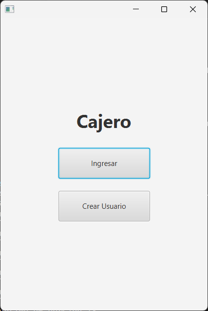
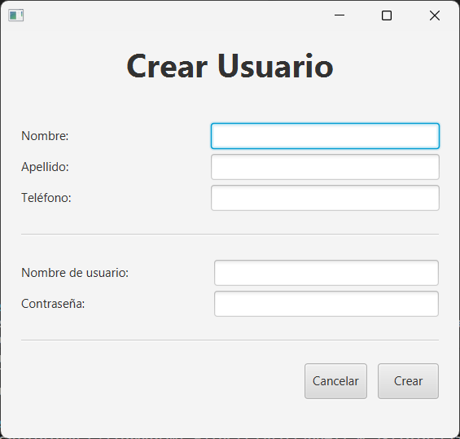
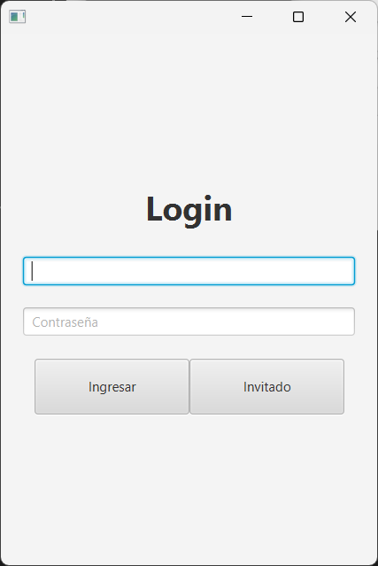
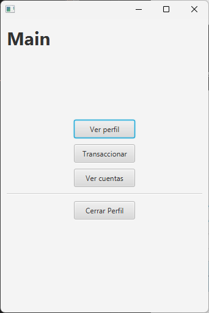
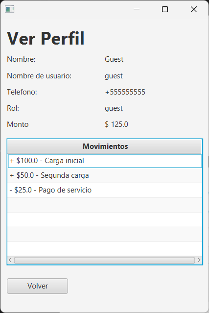
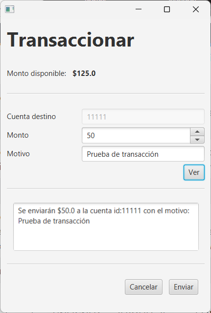
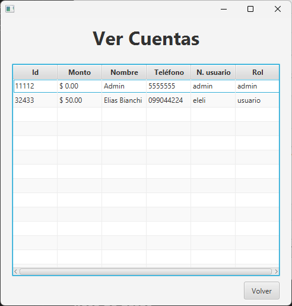
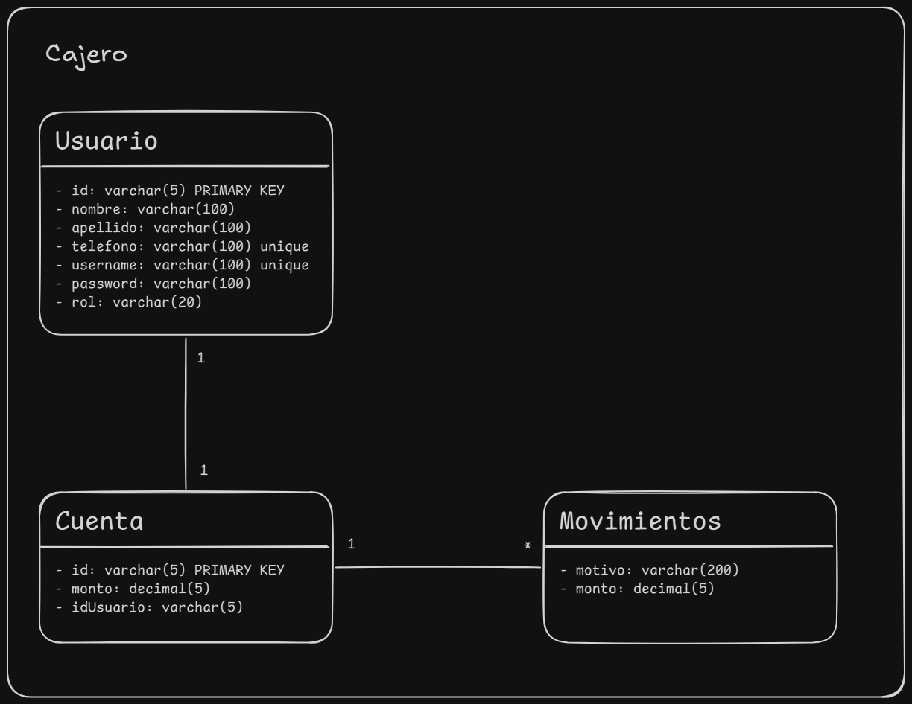

# Proyecto Cajero en Java

Proyecto simple en java, simulador de cajero automático con gestión de usuarios.

**index**
- [Desarrollo](#desarrollo)
    - [1. Inicio](#1-inicio)
    - [2. Creación de Usuario](#2-creación-de-usuario)
    - [3. Logueo](#3-logueo)
    - [4. Perfil](#4-perfil)
    - [5. Transaccionar](#5-transaccionar)
    - [6. Ver cuentas](#6-ver-cuentas)
- [Base de datos](#base-de-datos)
    - [Contenedor de MariaDB](#contenedor-mariadb)
    - [Diagrama](#diagrama)
    - [SQL](#sql)

## Desarrollo

### 1. Inicio



### 2. Creación de usuario



### 3. Logueo

Para la contraseña se utiliza un hash bcrypt(12) - [generador de hash online](https://bcrypt-generator.com/)





### 4. Perfil



### 5. Transaccionar



### 6. Ver cuentas

> [!NOTE]
> Solo para administradores (rol: admin)



## Base de datos

### Contenedor MariaDB

**Crear contenedor**

```sh
podman run -d \
    --name mariaDB \
  -e MARIADB_ROOT_PASSWORD=clave_root \
  -e MARIADB_DATABASE=mi_base \
  -e MARIADB_USER=usuario \
  -e MARIADB_PASSWORD=clave_usuario \
  -p 3306:3306 \
  mariadb:noble
```

> [!NOTE]
> Se puede acceder a este contenedor mediante el localhost:3306

**Acceder a la base de datos en el contenedor**

```sh
podman exec -it mariaDB mariadb -u root -p
```

### Diagrama



### SQL

[cajero.sql](./cajero.sql)

